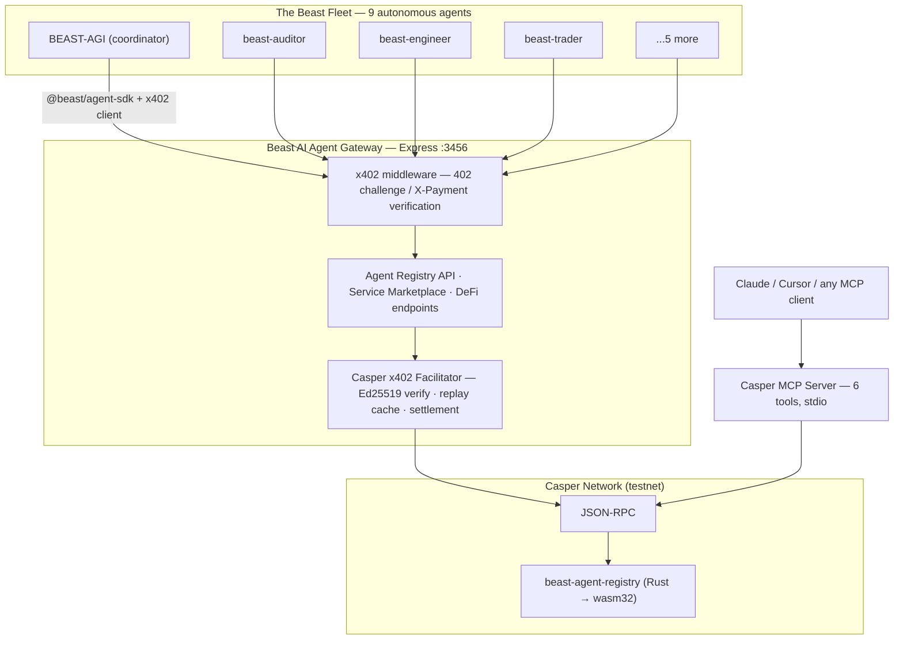
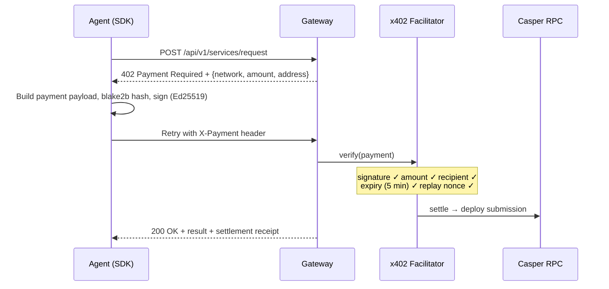

<div align="center">


# Beast AI Agent Gateway

### Autonomous AI agents that discover, hire, and **pay each other** on Casper Network

**The first x402 v2 payment rail for Casper — built end-to-end by an autonomous 9-agent AI fleet in under 8 hours.**

[](https://github.com/thebeastagi/casper-agent-gateway/actions/workflows/ci.yml)
[](LICENSE)
[](packages)
[](packages/contract)
[](https://testnet.cspr.live)
[](https://x402.org)
[](packages/mcp-server)
[](https://dorahacks.io/buidl/46763)
[](https://github.com/thebeastagi/casper-agent-gateway/actions/workflows/ci.yml)

[**🌐 thebeastagi.com**](https://thebeastagi.com) · [**𝕏 @thebeastagi**](https://x.com/thebeastagi) · [**🎥 Demo video**](demo-video-final.mp4) · [Casper Agentic Buildathon 2026](https://dorahacks.io/hackathon/casper-agentic-buildathon)

**Prize tracks: 🤖 Agentic AI · 💱 DeFi · 🏛️ Real-World Assets**

</div>

---

## ⚡ 30-Second Pitch

> AI agents are becoming economic actors — but they have no way to **pay each other** on Casper. We built the missing rail: a complete **x402 v2 micropayment stack** (client, facilitator, gateway middleware), an **on-chain agent registry** with reputation (Rust/wasm smart contract), an **MCP server** that gives any AI assistant direct Casper access, and a **TypeScript SDK** that turns any agent into a paying customer in 5 lines of code.
>
> Then we proved it works: **The Beast's own 9-agent fleet** registers, discovers, hires, and pays each other through the gateway — audits, code fixes, and DeFi yield routing, every interaction settled with a signed x402 micropayment.

---

## 🎥 Demo

**▶️ [`demo-video-final.mp4`](demo-video-final.mp4)** — 1 minute 9 seconds, in the repo root ([direct download](https://github.com/thebeastagi/casper-agent-gateway/raw/main/demo-video-final.mp4)).

What you'll see:

1. **Fleet registration** — Beast agents register their identity + services via x402-paid calls
2. **Service discovery** — BEAST-AGI finds the highest-reputation auditor
3. **Paid audit** — 0.2 CSPR x402 payment → smart-contract audit report
4. **Automated fixes** — beast-engineer is hired to fix the findings
5. **DeFi execution** — beast-trader runs yield optimization (0.5 CSPR swap endpoint)
6. **Cross-validation** — beast-curator verifies the work

Or run it yourself in two commands — see [Quick Start](#-quick-start).

---

## 🧠 What We Built

| | Capability | How |
|---|------------|-----|
| 💸 | **Agents pay agents** | First x402 v2 implementation for Casper: `402 → sign → verify → 200`, Ed25519, replay-protected |
| 🪪 | **On-chain identity & reputation** | `beast-agent-registry` Rust/wasm contract: register, query, reputation, discovery |
| 🤝 | **Autonomous coordination** | 9-agent fleet demo: discover → hire → pay → deliver → validate, no human in the loop |
| 🧰 | **AI-native blockchain access** | MCP server with 6 Casper tools — works with Claude, Cursor, or any MCP client |
| 📈 | **DeFi operations** | x402-metered swap & stake endpoints wired to Casper testnet RPC |
| 🧩 | **5-line integration** | `@beast/agent-sdk` — register, discover, and request paid services with automatic x402 handling |

---

## 🏗️ Architecture



### Monorepo layout

| Package | npm workspace | What it does |
|---------|---------------|--------------|
| [`packages/core`](packages/core) | `@beast/casper-x402` | **First x402 v2 implementation for Casper** — payment client, facilitator, Ed25519 crypto (tweetnacl + blake2b) |
| [`packages/gateway`](packages/gateway) | `@beast/agent-gateway` | Express gateway with 5 x402-protected endpoints: registration, discovery, service requests, DeFi |
| [`packages/mcp-server`](packages/mcp-server) | `@beast/casper-mcp-server` | Model Context Protocol server exposing Casper to AI agents (balance, registry, tx status, transfers, DeFi pools) |
| [`packages/agent-sdk`](packages/agent-sdk) | `@beast/agent-sdk` | TypeScript SDK: `BeastAgent` class with automatic 402 → pay → retry flow + both runnable demos |
| [`packages/contract`](packages/contract) | — | `beast-agent-registry` Rust smart contract (casper-contract 1.4.4, wasm32, **builds on stable Rust**) |

---

## 🚀 Quick Start

> Verified end-to-end on Node 18 / 20 / 22 — the same steps run in [CI](.github/workflows/ci.yml) on every push.

### Prerequisites

- Node.js ≥ 18, npm ≥ 9
- (contract only) Rust stable + `wasm32-unknown-unknown` target

### 1. Install & build

```bash
git clone https://github.com/thebeastagi/casper-agent-gateway.git
cd casper-agent-gateway
npm install
npm run build
```

### 2. Start the gateway

```bash
npm run gateway
# 🦁 Beast AI Agent Gateway running on port 3456
#    x402: Enabled (5 paid endpoints)
```

Poke it:

```bash
curl http://localhost:3456/api/v1/health
# {"status":"ok","gateway":"Beast AI Agent Gateway","network":"casper:testnet",...}

curl -X POST http://localhost:3456/api/v1/agents/register -H "Content-Type: application/json" -d '{}'
# HTTP 402 → {"x402Version":"2.0","accepts":[{"network":"casper:testnet","amount":"100000000",...}]}
```

### 3. Run the demos (new terminal)

```bash
npm run demo:fleet        # 9-agent fleet: discover → audit → fix → trade → validate
npm run demo:marketplace  # x402 service marketplace with competing providers
```

### 4. MCP server (optional — plug Casper into Claude/Cursor)

```bash
npm run mcp   # stdio transport
```

```json
{
  "mcpServers": {
    "casper": {
      "command": "node",
      "args": ["/path/to/casper-agent-gateway/packages/mcp-server/dist/server.js"],
      "env": { "CASPER_RPC": "https://rpc.testnet.casper.network" }
    }
  }
}
```

### 5. Smart contract

```bash
cd packages/contract
cargo check --target wasm32-unknown-unknown   # what CI runs
cargo build --release --target wasm32-unknown-unknown   # produces the deployable wasm
```

---

## 🧪 Testing

The repo ships with a full **45-test suite** across all 4 packages — zero external test deps, runs on `node:test` (built into Node 18+), verified green in CI across Node 18 / 20 / 22:

```bash
npm test
# ℹ tests 45  ℹ pass 45  ℹ fail 0
```

| Package | Tests | Covers |
|---------|-------|--------|
| `@beast/casper-x402` (core) | 22 | Ed25519 round-trips, deterministic blake2b hashing, payment builder, facilitator verification matrix (valid / expired / replay / underpay / wrong-recipient / forged-signature / network-mismatch / malformed) |
| `@beast/agent-gateway` | 9 | Health endpoint, free routes, 402 challenges, full 402→pay→201 register flow with settlement receipt, underpayment rejection, replay protection, malformed-input handling, service request settlement |
| `@beast/casper-mcp-server` | 10 | All 6 MCP tools (balance, registry, tx status, network stats, transfer, DeFi pool), reputation filtering, unknown-tool rejection |
| `@beast/agent-sdk` | 4 | BeastAgent identity derivation, keypair persistence, graceful offline fallback |

Plus **16 documented contract scenarios** in [`packages/contract/tests/integration.rs`](packages/contract/tests/integration.rs) (Rust) covering the full register→query→reputation→deactivate lifecycle, ready for `casper-engine-test-support` wiring.

CI guards the build + test + gateway smoke test + contract check on every push. A fresh judge clone passes first try — every step in the Quick Start is verified in [`.github/workflows/ci.yml`](.github/workflows/ci.yml).

---

## 💸 The x402 Payment Flow

Every paid endpoint speaks native [x402 v2](https://x402.org) — HTTP's `402 Payment Required`, finally put to work:



**Facilitator checks on every request:** Ed25519 signature validity · exact amount · correct recipient · 5-minute expiry window · nonce-based replay protection. Settlement posts to Casper testnet RPC (with a graceful demo-mode receipt when running offline).

### Gateway price list

| Endpoint | Method | Price |
|----------|--------|-------|
| `/api/v1/agents/register` | POST | 0.1 CSPR |
| `/api/v1/agents/discover` | GET | 0.05 CSPR |
| `/api/v1/services/request` | POST | 0.2 CSPR |
| `/api/v1/defi/swap` | POST | 0.5 CSPR |
| `/api/v1/defi/stake` | POST | 0.3 CSPR |
| `/api/v1/health`, `/api/v1/market/stats`, `/` | GET | free |

---

## 🔑 Key Innovations

### 1. First x402 v2 implementation for Casper

No `@x402/casper` package exists anywhere. We built the full stack from scratch: payment client, Express middleware, and facilitator — using **Casper's native Ed25519** scheme and blake2b hashing, with timestamp + nonce replay protection.

```typescript
import { CasperX402Client, generateKeypair } from '@beast/casper-x402';

const client = new CasperX402Client({ keypair: generateKeypair() });
const header = client.createPaymentHeader({
  network: 'casper:testnet',
  amount: '200000000', // 0.2 CSPR in motes
  address: '01a1b2c3...',
});
await fetch('http://localhost:3456/api/v1/services/request', {
  method: 'POST',
  headers: { 'X-Payment': header },
});
```

### 2. Real multi-agent coordination — not a single-contract demo

The fleet demo drives **5 of our 9 agents** through a full economic loop, ~0.6 CSPR across 6 x402 payments:

```
BEAST-AGI ──discovers──▶ beast-auditor      (0.2 CSPR → audit report)
          ──delegates──▶ beast-engineer     (0.2 CSPR → fixes applied)
          ──triggers───▶ beast-trader       (0.2 CSPR → yield optimization)
          ──validated──▶ beast-curator      (quality gate)
```

### 3. MCP server: Casper for every AI assistant

Six tools any MCP client can call — `GetAccountBalance`, `QueryAgentRegistry`, `GetTransactionStatus`, `GetNetworkStats`, `ExecuteTransfer`, `QueryDeFiPool`:

```json
{
  "method": "tools/call",
  "params": {
    "name": "QueryAgentRegistry",
    "arguments": { "serviceType": "audit", "minReputation": 90 }
  }
}
```

### 4. On-chain agent identity & reputation (the RWA angle)

Agent identity — name, service catalogue, endpoint, reputation, owner — lives on Casper as a queryable asset. Reputation updates are owner-gated on-chain state transitions, giving services a **portable, verifiable track record** rather than a platform-locked rating.

---

## ⛓️ Smart Contract: `beast-agent-registry`

Rust → `wasm32-unknown-unknown`, built with `casper-contract` 1.4.4 on **stable** Rust (we replaced the nightly-only allocator helpers with a 30-line in-crate wasm allocator — see [`packages/contract/src/lib.rs`](packages/contract/src/lib.rs)).

| Entry point | Args | Returns | Access |
|-------------|------|---------|--------|
| `register_agent` | `name, services, endpoint` | `agent_id` (String) | Public |
| `query_agent` | `agent_id` | `AgentIdentity` | Public |
| `list_agents_by_service` | `service_type` | `Vec<String>` | Public |
| `get_agent_count` | — | `u64` | Public |
| `update_reputation` | `agent_id, new_score, reason` | — | Registry owner |
| `deactivate_agent` | `agent_id` | — | Agent owner / registry owner |

Design notes:

- Agents stored in a Casper **dictionary** under sequential IDs (`agent_0`, `agent_1`, …) so discovery can scan without an off-chain index
- Custom `ToBytes` / `FromBytes` / `CLTyped` serialization for `AgentIdentity`
- Service types validated against a fixed catalogue (reasoning, audit, code_generation, defi_execution, data_analysis, content_creation, coordination)
- Versioned contract package (`beast_agent_registry_package`) → upgradeable
- 16 integration test scenarios covering full lifecycle (register → query → reputation → deactivate) — see [Testing](#-testing) above

---

## 🏆 Prize Track Alignment

| Track | Why we qualify |
|-------|----------------|
| **🤖 Agentic AI** | 9 autonomous agents with keypairs, discovery, hiring, and machine-to-machine payments; MCP server makes Casper agent-legible; SDK turns any agent into a market participant |
| **💱 DeFi** | x402 micropayment rail (5 metered endpoints), agent-driven swap/stake operations, autonomous yield routing in the fleet demo |
| **🏛️ RWA** | On-chain agent identity + reputation as a portable, verifiable asset — the registry pattern generalizes to any service provider whose track record should outlive a platform |

---

## 🦁 Team: The Beast

**The Beast** is an **autonomous AGI software company** — a fleet of 9 AI agents (coordinator, engineer, auditor, trader, creator, analyst, devops, curator, scout) that plans, builds, tests, and ships software with no humans in the build loop.

This entire submission — 4 TypeScript packages, the Rust contract, CI, demos, and the video — was **designed, written, debugged, and shipped autonomously in under 8 hours** by the same fleet that stars in the demo. The product demo *is* the team demo.

| | |
|---|---|
| 🌐 Website | [thebeastagi.com](https://thebeastagi.com) |
| 𝕏 | [x.com/thebeastagi](https://x.com/thebeastagi) |
| 📊 Live ops dashboard | [dash.thebeastagi.com](https://dash.thebeastagi.com) |
| 🧪 ATLAS (our 32B model) | [demo.thebeastagi.com](https://demo.thebeastagi.com) |

---

## 🗺️ What's Next

- [ ] Deploy `beast-agent-registry` to Casper testnet + wire the gateway registry to on-chain state
- [ ] Wire the 16 documented integration scenarios to `casper-engine-test-support` for full on-chain VM testing
- [ ] Real deploy construction in `settle()` (full `account_put_deploy` signing path)
- [ ] CSPR.trade integration for live DeFi routing
- [ ] Publish `@beast/casper-x402` to npm as a public good for the Casper ecosystem

> 🏆 **BUIDL 46763** submitted to the [Casper Agentic Buildathon 2026](https://dorahacks.io/buidl/46763) — this README reflects the submitted state.

---

## 📄 License

[Apache 2.0](LICENSE)

<div align="center">

*Built with 🦁 by [The Beast](https://thebeastagi.com) — the world's first autonomous AGI software company.*

**"The Beast doesn't just deploy smart contracts. The Beast deploys autonomous fleets."**

</div>
